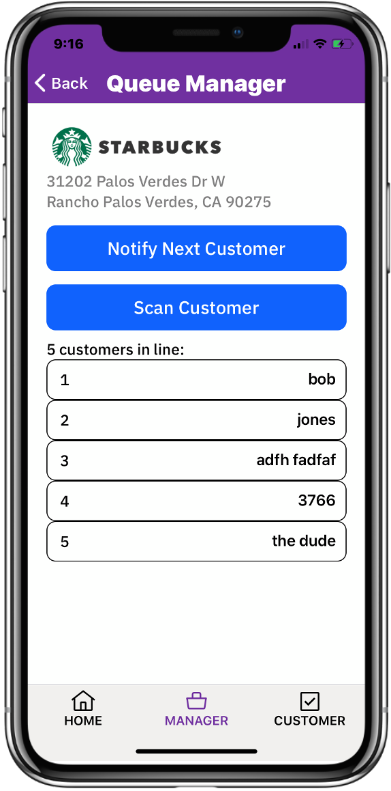
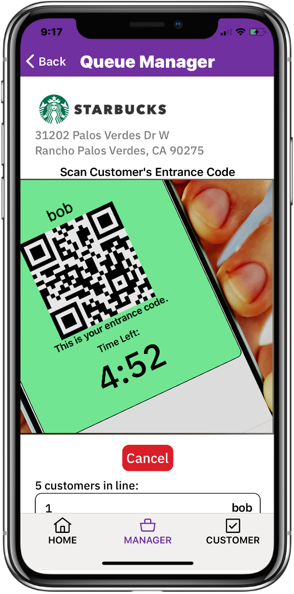

# Safe-Queue

## Authors

- Dave Chura

## Contents

1. [Overview](#overview)
2. [The idea](#the-idea)
3. [How it works](#how-it-works)

## Overview

### What's the problem?

COVID-19 has changed everyone's lives and social distancing has created an new environment for stores, polling places, restaraunts and businesses of all kinds.  The need to limit entry has created long lines of people at least 6 feet apart, who must stand for a long times outside in hot and cold weather.  This is not just inconvience but also discourages necessary shopping and can even harm our democracy as shown in the Wisconsin Election,  where lines reached several hours long.

This is a problem that can impact tens of thousands of businesses and millions of people every day.  Below are pictures of the problem at a Costco and at a Wisconsin polling place:

### How can technology help?

Of course, physical lines can be replaced by virtual lines, where people do not have to be physically in a line to "be in line". Virtual lines are "safe" because you are never near anyone else while waiting, as you are with physical lines (as in the pictures above). Virtual lines don't subject customers to bad weather (hot or cold) and can work for businesses with little parking (such as a restaraunts now doing all take-out)

However, there are already many "reservation" systems available today, however these do not address the ad-hoc nature of shopping where the time taken by a customer in a store varies widely and when they go is not planned.  As such, reservation systems cannot handle the on-demand nature of shopping (and voting) that people see as "normal".  People want to go to stores when they want to go, and spend the time they need. This behavior cannot be "reserved" effectively for the customer and cannot be effectively managed by the business (i.e. no shows, late shows...).  In these COVID-19 times, restoring the ability to just go to the store brings back a sense of normalcy.

Furthermore, reservation systems are hard to use, including sign-ups, calendars, personal information, and a promise to show up in the future, which must be managed by businesses.  Stores (e.g. Costco) will find it impossible to use reservation systems for on-demand shopping, Polling places will find it impossible to create reservations for voting - voting is a right, and missing your reservation isn't a viable option for democracy.

Safe Queue is completely different.

## The idea

SAFE QUEUE IS A COMPLETELY DIFFERENT IDEA THAN A RESERVATION SYSTEM. It does create virtual lines ("safe queues") but it directly solves the on-demand nature that consumers want as "normal" for shopping. It does so with a unique combination of technologies that result in queuing that is safe in COVID-19 times, both for consumers and employees.  It eliminates the hardships characterized by the lines in the pictures above.

Safe Queue is an amazingly easy to use App that for both the business (or polling place) and the consumer.   There is no sign up required for consumers or for busineses, so it can be used immediately upon download. Absolutely no personal information is required, and consumers can be in line at a business within seconds of downloading the app to their devices.   Consumers use the app to join "safe queues" and businesses use the app to manage entry into their business.   A business can have as many safe queues as they want, managing each independently.

Safe Queue is realized as a mobile app with cloud services (including computing, middleware, databases, push notifications, geolocation, geocoding). The mobile app is implemeneted in react-native and all cloud services have been tested in the IBM Cloud.   There is no need for an adminstrator of the system beyond scaling the cloud services (i.e. no sign up or authentication or so forth).

## How it works

The key element of Safe Queue is GPS location.  The app uses your GPS location as a condition for entering the 'safe queue' of a business.  A consumer can enter a line for a business if he is located within 1000 feet of the business.  It doesn't matter who you are, as long as you are nearby. Typically you will be waiting in your car where you are 'safe' rather than standing outside in a line with lots of other people, subject to the virus and the elements (hot or cold). If you drive away from the business, you are removed from the line automatically by the App.  The app provides directions to businesses and clearly shows when you can get in line at a business (i.e. you are close enough to it)

A business creates a 'safe queue' for itself using the same App. The manager (or employee) creates the queue, where the GPS location of that person becomes the location used for the business.  This becomes published where consumers see it in their Apps (based upon their location).  For convienence, the app reverse-geocodes the location into an address so the business does not need to enter (though it can edit it).  Once created, an employee of the business controls the actual entry of people with a few simple buttons.  The business can delete the 'safe queue' at any time, if they want.  However, any consumer who shows up long before opening hours can get in line, provided they stay close to the business!

Another key element of Safe Queue is a QR-Code.  The identity of persons in line is encapsulated in a randomly-generated QR Code by the App,  which is scanned by the business to validate entry.  This requires nothing from the user, so is super-easy to use. In addition, it is completely anonymous, as consumers expect when shopping. 

Another key element of Safe Queue is Push Notifications.  The employee at the business manages the line using the Safe Queue App, and notifies consumers when they should come in. The system automatically notifies the next few people in line that their time is coming soon.  There is no texting, cell phone numbers or any other personal information used, so this is again super easy for consumers and anonymous as well.

The last key element of Safe Queue is Voice Alerts.  Consumers get typical notifications through texting or notifications, but Safe Queue adds brief audio to them.  Instead of a ding, they hear a short message like: "This is Safe Queue, you are next in line".  Consumers do not have to watch their phones continuosly and can do other things while waiting. The voice alert is much more user friendly.

### Typical Use Cases

<b>1. A CONSUMER GOES TO A STORE</b>: A consumer wants to go to Costco for a number of items.  He opens up Safe Queue, taps on 'CUSTOMER' and sees his Costco has a 'safe queue'. Great, he is far away so can't get in line. He drives to the Costco and when he gets close enough (1000 feet) to the store, his app turns green for Costco. He taps on it (it is an obvious and large area) and he's entered into the line. He parks his car and waits there, safe and sound.

<table style="width:100%; border:0;">
<colgroup>
      <col span="1" style="width: 15%;">
      <col span="1" style="width: 32%;">
      <col span="1" style="width: 15%;">
      <col span="1" style="width: 33%;">
   </colgroup>
   <tbody>
<tr>
<th>
Tap on 'CUSTOMER'. A list of published safe queues ordered by distance  appears. One of more are green, indicating you are close enough to join that safe queue.
</th>
<th>

</th>
<th>
Tap the on greeen Costco entry, which confirms you want to join the safe queue and offers an optional nickname. 'frank' was typed in as the nickname.
</th>
<th>

</th>
</tr>
</trbody>
</table>

As his turn in line approaches, he receives notifications with audio alerts:  "this is Safe Queue, you are now second in line" so he can get ready,  and then finally: "this is safe queue, you can go in now.".

He leaves his car and goes in, shows his QR Code to the employee who scans it (also using the App) which confirms he is the next one in line.  The successful scan then removes him from the line and notifications go out to everyone else waiting.

<b>2. A BUSINESS CREATES A SAFE QUEUE</b>:  A manager (or employee) of a business opens up Safe Queue, taps on "MANAGER" and sees an empty list. He taps on Add and enters the business name (and optional logo and address, though this is pre-populated by the App from the GPS location).  He then taps on Save, which publishes this for consumers to find (as per CONSUMER use case above). He then see a list, which includes what he created. He taps on it to manage it (see BUSINESS MANAGE use case below).  
Note that a business can have as many safe queues at their location as they want, each managed

<b>3. A BUSINESS MANAGES ENTRY TO A STORE:

